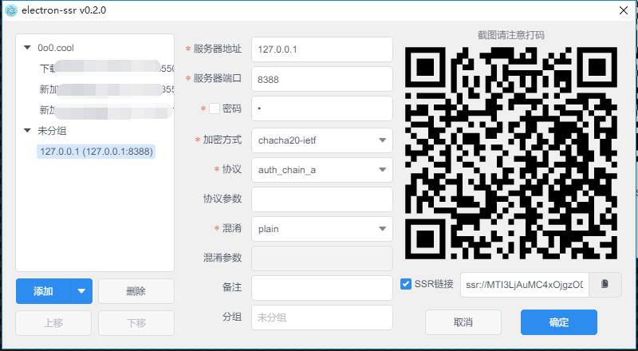

# Electron-Paste

[English](README.md)


这是一个使用[Electron](https://www.electronjs.org/) 和 [Vue.js](https://vuejs.org/)
(UI 组件: [ElementUI](https://element.eleme.cn/)). 当前仅支持window环境.
(现在部分功能支持ubuntu20.04.)

设计风格借鉴了Mac平台的 [Paste](https://pasteapp.io/).

## Linux 用户注意
在`Fedora`等平台可能未默认安装 `libsodium`, 可手动安装: `dnf install libsodium`

在`Ubuntu 18.04`系统等系统之外的`Gnome`桌面, 默认未安装 `AppIndicator`，可安装[此插件](https://extensions.gnome.org/extension/615/appindicator-support/)解决(可在商店 Add-ons-Shell Extensions查找安装)


## 下载

<!-- 下载地址见[Github release](https://github.com/erguotou520/electron-ssr/releases)，对应的操作系统下载的文件为

- Windows `electron-ssr-setup-x.x.x.exe`
- Mac `electron-ssr-x.x.x.dmg`
- Linux 优先建议下载`electron-ssr-x.x.x.AppImage`，直接双击运行。如果无法使用或者想直接下载自己系统专用包请看下一条
- Arch或者基于Arch的系统，下载`electron-ssr-x.x.x.pacman`
- RedHat系列的系统，下载`electron-ssr-x.x.x.rpm`
- Debian系列的系统，下载`electron-ssr-x.x.x.deb`
- 系统Linux系统或者通用Linux系统可下载`electron-ssr-x.x.x.tar.gz`（不会使用.tar.gz的请自行百度） -->

## 配置文件位置

<!-- - Windows `C:\Users\{your username}\AppData\Roaming\electron-ssr\gui-config.json`
- Mac `~/Library/Application Support/electron-ssr/gui-config.json`
- Linux `~/.config/gui-config.json` -->


## 应用截图

<!--  -->


## 开发和构建

``` bash
# or npm install
yarn

# 开发时
npm run dev

# 打包构建
npm run build

# 代码风格检查
npm run lint

```

## Changelog更新日志

请直接查看[release发布说明](https://github.com/erguotou520/electron-ssr/releases)


---

This project was generated with [electron-vue](https://github.com/SimulatedGREG/electron-vue) using [vue-cli](https://github.com/vuejs/vue-cli). Documentation about the original structure can be found [here](https://simulatedgreg.gitbooks.io/electron-vue/content/index.html).
