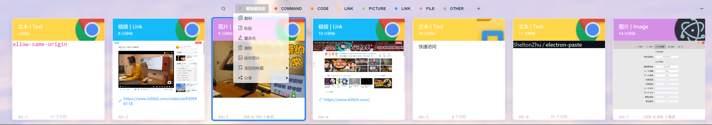
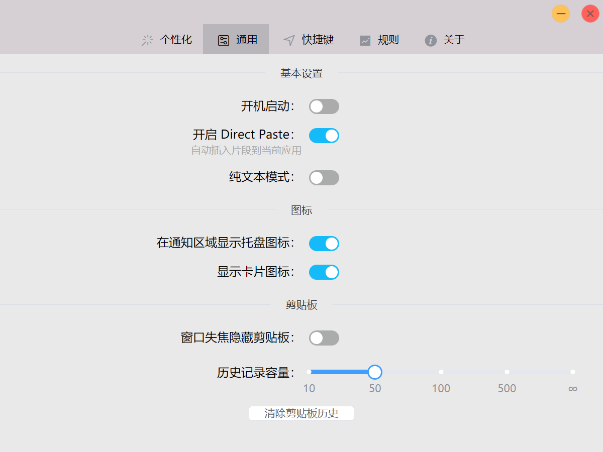
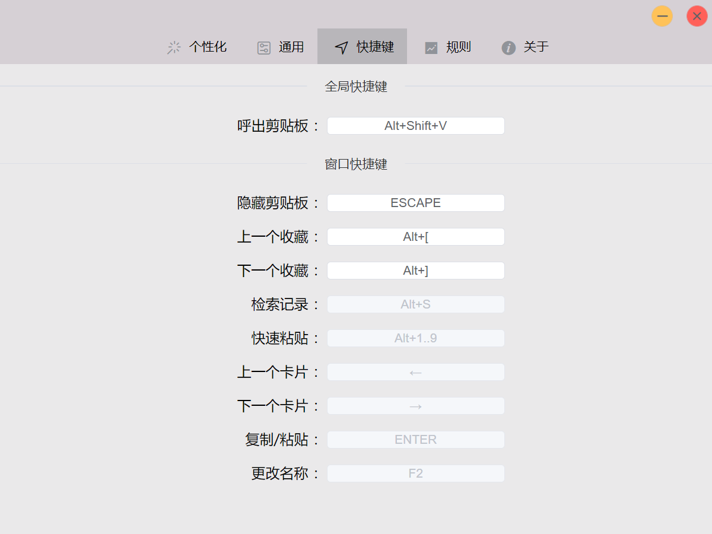

# Electron-Paste

[English](README.md)


这是一个使用[Electron](https://www.electronjs.org/) 和 [Vue.js](https://vuejs.org/)
(UI 组件: [ElementUI](https://element.eleme.cn/)). 当前仅支持 window 环境.
(现在部分功能支持 ubuntu20.04.)

设计风格借鉴了 Mac 平台的 [Paste](https://pasteapp.io/).

## Linux 用户注意

在`Fedora`等平台可能未默认安装 `libsodium`, 可手动安装: `dnf install libsodium`

在`Ubuntu 18.04`系统等系统之外的`Gnome`桌面, 默认未安装 `AppIndicator`，可安装[此插件](https://extensions.gnome.org/extension/615/appindicator-support/)解决(可在商店 Add-ons-Shell Extensions 查找安装)

## 下载

下载地址见[Github release](https://github.com/SheltonZhu/electron-paste/releases)，对应的操作系统下载的文件为

- Windows `Electron.Paste-setup-x.x.x.exe`

[comment]: <> (- Mac `Electron.Paste-x.x.x.dmg`)
- Linux 优先建议下载`Electron.Paste-x.x.x.AppImage`，直接双击运行。如果无法使用或者想直接下载自己系统专用包请看下一条

[comment]: <> (- Arch或者基于Arch的系统，下载Electron.Paste-x.x.x.pacman`)

[comment]: <> (- RedHat系列的系统，下载`Electron.Paste-x.x.x.rpm`)
- Debian系列的系统，下载`Electron.Paste-x.x.x.deb`
- 系统Linux系统或者通用Linux系统可下载`Electron.Paste-x.x.x.tar.gz`（不会使用.tar.gz的请自行百度） -->

## 配置文件位置

- Windows `C:\Users\{your username}\AppData\Roaming\electron-paste\config.json`

[comment]: <> (- Mac `~/Library/Application Support/electron-paste/config.json`)
- Linux `~/.config/'Electron Paste'/config.json`

## 应用截图








## 开发和构建
### 构建需求
安装:
* Windows
  * windows-build-tools npm package (`npm install --global --production windows-build-tools`)
* Mac
  * Xcode Command Line Tools.
* Linux
  * Python (v2.7 recommended, v3.x.x is not supported).
  * make.
  * A C/C++ compiler like GCC.
  * libxtst-dev and libpng++-dev (`sudo apt-get install libxtst-dev libpng++-dev`).

安装node-gyp:
```bash
# npm install -g node-gyp`
yarn global add node-gyp
```

### 开发
```bash
# or npm install
yarn

# 开发时
# or npm run dev
yarn dev

# 打包构建
# or npm run build
yarn build

# 代码风格检查
# or npm run lint
yarn lint

# 编译本地包
# or npm run rebuild
yarn rebuild
```

## Changelog 更新日志

请直接查看[release 发布说明](https://github.com/SheltonZhu/electron-paste/releases)

---

This project was generated with [electron-vue](https://github.com/SimulatedGREG/electron-vue) using [vue-cli](https://github.com/vuejs/vue-cli). Documentation about the original structure can be found [here](https://simulatedgreg.gitbooks.io/electron-vue/content/index.html).
