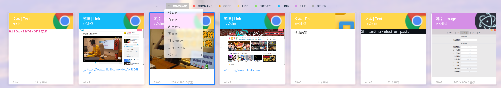
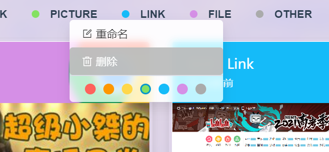
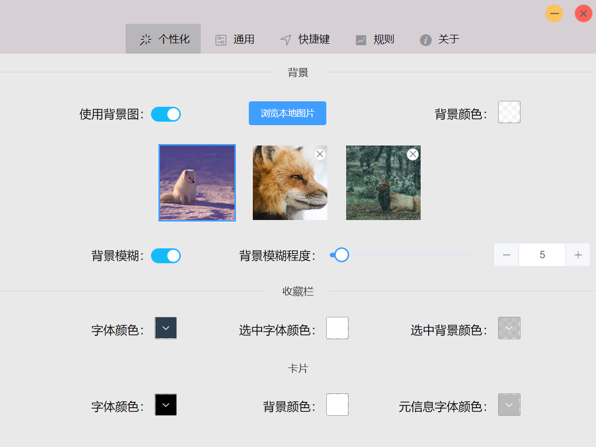
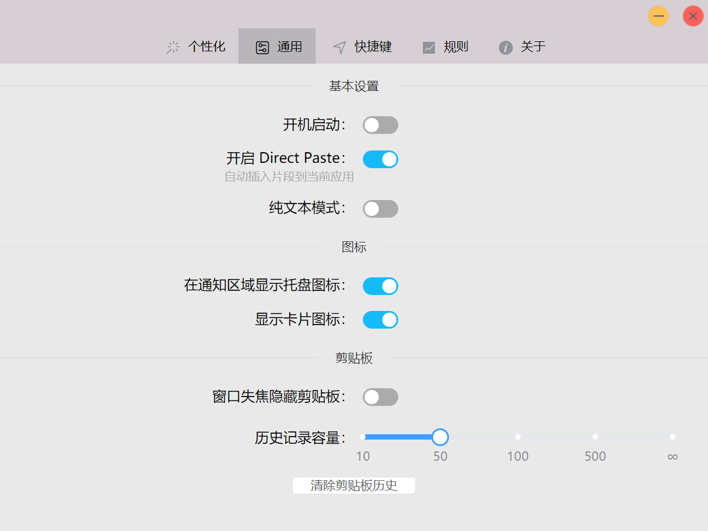
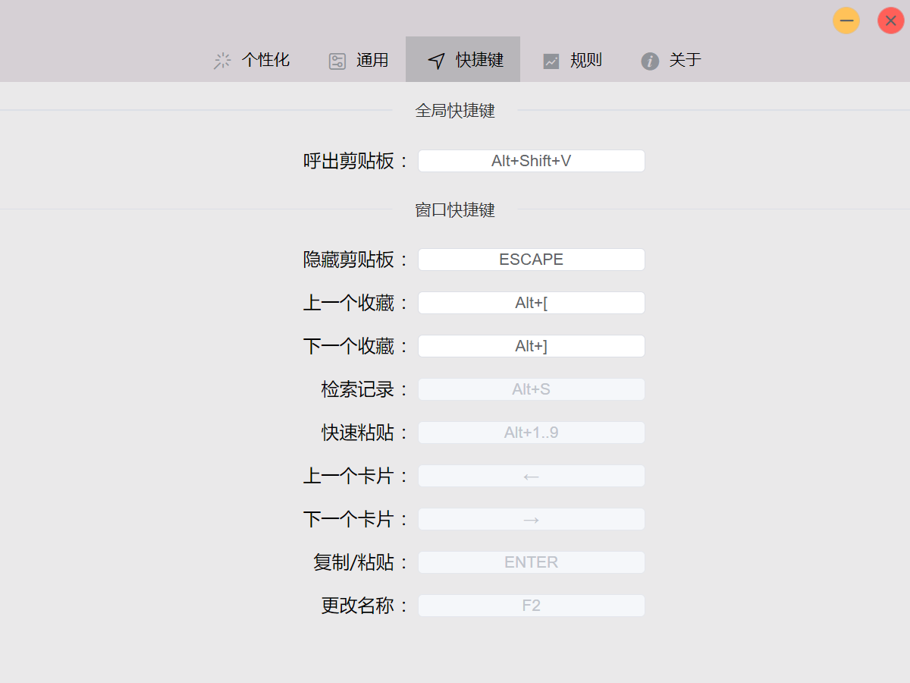
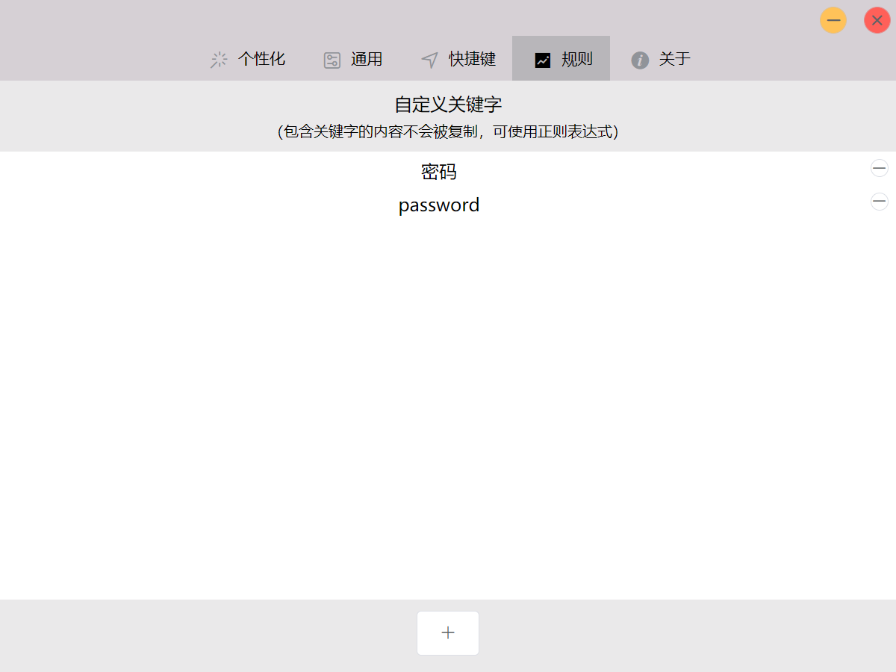

# Electron-Paste

[中文](README-CN.md)


This app is a clipboard tool programed by [Electron](https://www.electronjs.org/) and [Vue.js](https://vuejs.org/)
(UI Component: [ElementUI](https://element.eleme.cn/)). It supports Windows only.
(Now supports ubuntu20.04 for some features.)

The design style of this app imitates [Paste](https://pasteapp.io/) on Mac.

## Note for Linux user

By default the `libsodium` maybe not get installed on some platform, for example, the `Fedora`, you can install it manually by command `dnf install libsodium`.

On some systems that use `Gnome` desktop, except `Ubuntu 18.04`, may not have the `AppIndicator` installed, you can manually install this [plugin](https://extensions.gnome.org/extension/615/appindicator-support/) to fix it. (or find it in the store's Add-ons-Shell Extensions)

## Download

Visit the releases page [Github release](../../releases/latest):

- Windows `Electron.Paste-setup-x.x.x.exe`

[comment]: <> (- Mac `Electron.Paste-x.x.x.dmg`)
- Linux (recommended) `Electron.Paste-x.x.x.AppImage`, double click to run. If you cannot use it or want to download your own system-specific package please use the following options

[comment]: <> (- Arch or Arch-based distributions `Electron.Paste-x.x.x.pacman`)

[comment]: <> (- RedHat derivatives `Electron.Paste-x.x.x.rpm`)
- Debian derivatives `Electron.Paste-x.x.x.deb`
- Other Linux distributions `Electron.Paste-x.x.x.tar.gz`

## Configuration file location

- Windows `C:\Users\{your username}\AppData\Roaming\electron-paste\config.json`

[comment]: <> (- Mac `~/Library/Application Support/electron-paste/config.json`)
- Linux `~/.config/'Electron Paste''/config.json`

## Application screenshots









## Build
### Building require
installation:
* Windows
  * windows-build-tools npm package (`npm install --global --production windows-build-tools` from an elevated PowerShell or CMD.exe)
* Mac
  * Xcode Command Line Tools.
* Linux
  * Python (v2.7 recommended, v3.x.x is not supported).
  * make.
  * A C/C++ compiler like GCC.
  * libxtst-dev and libpng++-dev (`sudo apt-get install libxtst-dev libpng++-dev`).

Install node-gyp using npm:
```bash
# npm install -g node-gyp`
yarn global add node-gyp
```

### Development
```bash
# or npm install
yarn

# run in development mode
# or npm run dev
yarn dev

# run in development mode
# or npm run build
yarn build

# run the code style check
# or npm run lint
yarn lint

# rebuild native package
# or npm run rebuild
yarn rebuild
```

## Changelog

Please check the [release notes](../../releases/latest).

---

This project was generated with [electron-vue](https://github.com/SimulatedGREG/electron-vue) using [vue-cli](https://github.com/vuejs/vue-cli). Documentation about the original structure can be found [here](https://simulatedgreg.gitbooks.io/electron-vue/content/index.html).
